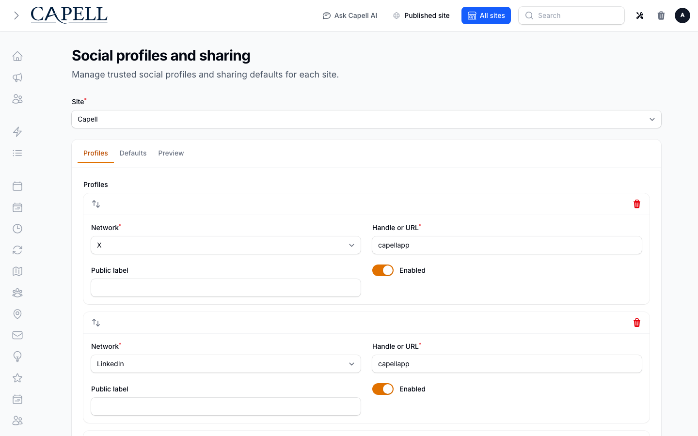
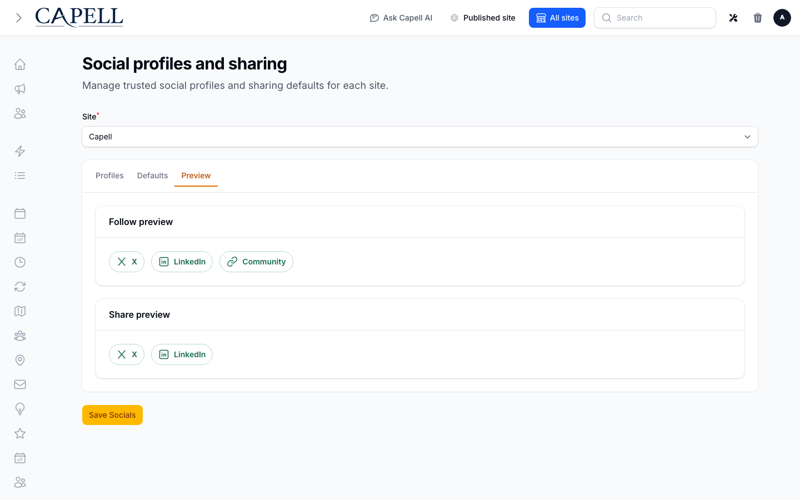

# Socials

<!-- prettier-ignore-start -->

## What This Plugin Adds

Socials is an **Available**, **Schema-owning** Capell package in the **Capell Foundation** product group. It ships as `capell-app/socials` and extends these surfaces: admin, frontend, console, shared.

Socials adds site-scoped registered and custom social profiles, shared follow and share defaults, and an explicit Block Library widget.

Admins manage profiles and previews on the Socials page, then editors place follow or share links on selected pages. Visitors receive accessible links without social SDKs or tracking scripts.

Evidence: [`src/Filament/Pages/SocialsPage.php`](src/Filament/Pages/SocialsPage.php), [`src/Blocks/SocialsBlockDefinitionProvider.php`](src/Blocks/SocialsBlockDefinitionProvider.php), [`capell.json`](capell.json), [`src/Blocks/SocialsBlockRenderer.php`](src/Blocks/SocialsBlockRenderer.php), [`resources/views/blocks/socials.blade.php`](resources/views/blocks/socials.blade.php), [`tests/Unit/BuildShareLinksActionTest.php`](tests/Unit/BuildShareLinksActionTest.php).

Status details:

- Status: Available
- Tier: free
- Bundle: foundation
- Composer package: `capell-app/socials`
- Namespace: `Capell\Socials`
- Theme key: not applicable

## Why It Matters

**For developers:** The network registry, public resolver contract, and typed render data keep profile validation separate from admin forms and public rendering.

**For teams:** Teams can approve social profiles once per site, reuse them in follow blocks, and offer canonical page sharing without embedding third-party scripts.

Evidence: [`src/Contracts/SocialNetworkRegistry.php`](src/Contracts/SocialNetworkRegistry.php), [`src/Contracts/SocialProfilesResolver.php`](src/Contracts/SocialProfilesResolver.php), [`src/Actions/ResolveSiteSocialProfilesAction.php`](src/Actions/ResolveSiteSocialProfilesAction.php), [`tests/Unit/SocialNetworkRegistryTest.php`](tests/Unit/SocialNetworkRegistryTest.php), [`src/Actions/SaveSocialSiteConfigurationAction.php`](src/Actions/SaveSocialSiteConfigurationAction.php), [`src/Actions/BuildFollowSocialRenderDataAction.php`](src/Actions/BuildFollowSocialRenderDataAction.php), [`src/Actions/BuildShareSocialRenderDataAction.php`](src/Actions/BuildShareSocialRenderDataAction.php), [`tests/Unit/ResolveSiteSocialProfilesActionTest.php`](tests/Unit/ResolveSiteSocialProfilesActionTest.php).

## Screens And Workflow

Screenshot contract: `docs/screenshots.json`.

- Site-scoped Socials management (admin, required).
- Follow/share defaults and unsaved preview (admin, required).
- Accessible follow widget output (frontend, required).
- Canonical share widget output (frontend, required).
- Developer registry extensibility (shared, required).

## Works With

No optional companion integrations are currently declared with executable evidence.

## Technical Shape

- Service providers: `Capell\Socials\Providers\SocialsServiceProvider`, `Capell\Socials\Providers\AdminServiceProvider`.
- Migrations: `packages/socials/database/migrations/2026_07_16_000001_create_social_profiles_table.php`, `packages/socials/database/migrations/2026_07_16_000002_create_social_site_preferences_table.php`.
- Models: `SocialProfile`, `SocialSitePreferences`.
- Filament classes: `SocialsBuilderBlock`, `SocialsPage`.
- Extension contracts: `SocialNetworkRegistry`, `SocialProfileNormalizer`, `SocialProfileValidator`, `SocialProfilesResolver`, `SocialShareUrlGenerator`.
- Actions: `BuildFollowSocialRenderDataAction`, `BuildShareLinksAction`, `BuildShareSocialRenderDataAction`, `ImportLegacySocialProfilesAction`, `OverrideSocialNetworkDefinitionAction`, `RegisterBuiltInSocialNetworksAction`, `ResolveSiteSocialProfilesAction`, `SaveSocialSiteConfigurationAction`.
- Data objects: `LegacySocialImportResultData`, `NormalizedSocialProfileData`, `ShareLinkData`, `ShareLinksData`, `SharePageContextData`, `SocialCustomLinkConfigurationData`, `SocialFollowRenderData`, `SocialFollowWidgetConfigData`, `SocialNetworkDefinitionData`, `SocialProfileConfigurationData`, `SocialProfileData`, `SocialProfilesData`, `and 3 more`.
- Command signatures: `capell:socials-install`.
- Console command classes: `InstallSocialsCommand`.
- Manifest contributions: `admin-page: Capell\Socials\Manifest\SocialsAdminPageContribution`, `frontend-component: Capell\Socials\Manifest\SocialsWidgetContribution`, `model: Capell\Socials\Manifest\SocialProfileModelContribution`, `model: Capell\Socials\Manifest\SocialSitePreferencesModelContribution`.
- Health checks: `Capell\Socials\Health\SocialsHealthCheck`.
- Blade views: `packages/socials/resources/views/blocks/icon.blade.php`, `packages/socials/resources/views/blocks/socials.blade.php`, `packages/socials/resources/views/filament/pages/socials.blade.php`, `packages/socials/resources/views/filament/partials/follow-preview.blade.php`, `packages/socials/resources/views/filament/partials/share-preview.blade.php`.
- Cache tags: `socials`.

## Data Model

- Required tables: `social_profiles`, `social_site_preferences`.
- Models: `SocialProfile`, `SocialSitePreferences`.
- Core record references in migrations: `sites via site_id`.
- Migration files: `2026_07_16_000001_create_social_profiles_table.php`, `2026_07_16_000002_create_social_site_preferences_table.php`.
- Migration impact: run host migrations through the package install flow before opening package surfaces.
- Deletion/retention behaviour: migrations declare cascade-on-delete relationships; no timed pruning or retention schedule is declared in `capell.json`.

## Install Impact

- Required packages: `capell-app/core`, `capell-app/admin`, `capell-app/frontend`, `capell-app/block-library`.
- Admin navigation: declares `admin-page: SocialsAdminPageContribution`; each Filament page or resource controls its own navigation visibility.
- Admin/editor extensions: none declared.
- Permissions: `View:SocialsPage`.
- Public routes: none declared.
- Database changes: package migrations are declared.
- Config: no package config files.
- Settings: no package settings declared.
- Queues or schedules: none declared.
- Cache tags: `socials`.
- Commands: `capell:socials-install`.

## Common Pitfalls

- Keep required Capell packages on compatible v4 releases: `capell-app/core`, `capell-app/admin`, `capell-app/frontend`, `capell-app/block-library`.
- Run migrations before opening package resources or public routes.
- Keep public Blade and cached HTML free of authoring markers, model IDs, permissions, signed editor URLs, and lazy database queries.
- Custom write integrations must preserve invalidation for `socials` cache tags.

## Troubleshooting

| Symptom | Likely cause | Check | Fix |
| --- | --- | --- | --- |
| Package surface is missing after install | Provider or manifest is not loaded | Confirm `capell.json`, package `composer.json`, and provider registration | Reinstall the package, refresh Composer autoload, and clear host caches |
| Admin screen or command fails on missing table | Package migrations have not run | Check the tables listed in `Data Model` | Run host migrations and rerun the focused package test |
| Public output leaks unexpected state | Render data, cache variation, or authoring boundary has regressed | Check public Blade, cache tags, and public-output safety tests | Move data loading out of Blade and rerun the package public-output tests |

## Quick Start

1. Install the package: `composer require capell-app/socials`.
2. Run the required setup: `php artisan capell:socials-install`.
3. Open the Site-scoped Socials management and confirm the admin workflow loads.

## Next Steps

- [Package docs](docs/README.md)
- [Overview](docs/overview.md)
- [Troubleshooting](#troubleshooting)
- [Screenshot contract](docs/screenshots.json)
- [Marketplace assets](docs/assets/marketplace/)
- [Capell content language plan](../../docs/CONTENT_LANGUAGE_PLAN.md)
- [Capell documentation design system](../../docs/DESIGN_SYSTEM.md)
- [Capell and package ERD notes](../../docs/erd/capell-and-package-erds.md)
- Related packages: [Block Library](../block-library/README.md).
- Focused tests: `vendor/bin/pest packages/socials/tests --configuration=phpunit.xml`.

<!-- prettier-ignore-end -->
